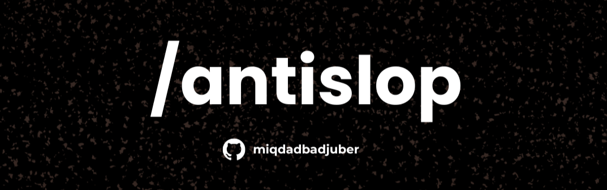

<p align="right">
  <a href="README-ID.md"></a>
  <a href="README.md"></a>
</p>

# Anti AI Slop: Design & Copy Rules



> Design rules to stop AI coding agents from generating generic UI ("AI slop") without becoming sterile. Includes 38 rules across three tiers, a Liveliness Toolkit, and a mandatory delivery gate.

---

## What Is This?

`ANTISLOP.md` is a specialist rules document for UI/UX design work, designed to be **read on-demand** by AI coding agents, not force-loaded into every session regardless of the task. The file contains:

- **Part 1:** Warning signs of AI slop (generic blue-purple gradients, excessive glassmorphism, marketing buzzwords, etc.); a diagnostic scan, not a ban list
- **Part 2:** 38 mandatory rules (R-01 to R-38) grouped into three tiers: Hard Gate (absolute), Purpose-Gate (technique allowed, reason required), Quality Locks (consistency)
- **Part 3:** Liveliness Toolkit with three dials (ENERGY / RHYTHM / MOTION), positive levers, and a Design Read to set direction before generating
- **Craftsmanship Standard:** five preference-agnostic quality criteria (intentionality, functional completeness, content-driven composition, resilience, evidence over claims)
- **Functional Patterns:** concrete meanings of "a working button" for static landing pages
- **Checklist:** a mandatory Delivery Gate in four blocks (Hard / Purpose-Gate / Liveliness / Craftsmanship & Quality Locks) reported as a PASS/FAIL status with concrete evidence per item, run before delivering

> `ANTISLOP.md` is a **filter, not a style guide**. It does not impose an aesthetic: no prescribed colors, fonts, or layouts. It does not ban visual techniques; it rejects technique without purpose and requires liveliness (Part 3). Design preferences and brand direction are yours.
>
> `ANTISLOP.md` is the **filter** in a 3-file setup: `DESIGN.md` (yours) supplies direction and makes results feel alive, `AGENTS.md` (yours) routes the agent to read both. This file alone prevents slop but cannot invent direction; a sterile result means the direction was missing or liveliness was not added, not that the filter failed.

---

## Setup: The 3-File System

`ANTISLOP.md` works together with two files that you own:

```
Project root/
├── AGENTS.md (or CLAUDE.md, GEMINI.md, etc.)    # router: tells the agent what to read
├── DESIGN.md                                    # direction: the soul of your UI (yours)
└── ANTISLOP.md                                  # filter: this repo
```

- **`AGENTS.md`** (or `CLAUDE.md`, `GEMINI.md`, etc.) is the entry-point file the agent **always** reads at the start of a session. It routes the agent to the files it needs per task.
- **`DESIGN.md`** is your style direction: identity, personality, palette, typography, mood. It is what makes a result feel alive and specific. How you fill it is your business: write it yourself, or build it from visual references you find online, whatever matches your style and taste.
- **`ANTISLOP.md`** is the filter. It stops the slop patterns on top of whatever direction `DESIGN.md` sets. It does not add beauty on its own. A sterile result means the direction was missing, not that the filter failed.

Keep `ANTISLOP.md` wherever your other rules files live (project root, `.agent/`, `.ai/`, etc.), and add a **single pointer block** to your entry-point file (`AGENTS.md`, `CLAUDE.md`, `GEMINI.md`, etc.):

```md
## Design & UI
If the task involves building or editing UI/UX, read `DESIGN.md`
(style direction) then `ANTISLOP.md` (filter) before generating anything.
```

Why this pattern beats merging everything in:

- **Saves context:** hundreds of lines of design rules only get loaded when actually relevant, instead of bloating every non-UI/backend task
- **Easier to maintain:** updating `ANTISLOP.md` or `DESIGN.md` never requires touching the project's entry-point file
- **Portable:** the same `ANTISLOP.md` can be reused across projects by just copying the file and adding one pointer block

### Direction and liveliness

`DESIGN.md` sets the direction; Part 3 of `ANTISLOP.md` sets the liveliness target. You can optionally include a dial line in `DESIGN.md`, for example `Dial: ENERGY 2 / RHYTHM 3 / MOTION 1`, and the agent will design to it. Without a dial line, the agent infers the dials from your brief and asks one question if the direction is ambiguous.

This pattern is **generic and tool-agnostic**. The pointer block above is a plain natural-language instruction that the agent executes using its own file-read tool, so it works identically in Claude Code, Codex, Cursor, Windsurf, or any other agent capable of reading a referenced file.

### Manual / one-off prompt

Don't want to set up any file? Copy the full contents of `ANTISLOP.md` and paste it at the start of your prompt before asking the agent to design something.

> **Warning:** This approach is less reliable than the 3-file setup. When a long block of rules is pasted into a chat rather than loaded as a native context file, agents are more likely to partially ignore or hallucinate past the instructions, especially as the conversation grows longer. Use it as a quick fallback, not a primary setup.

---

## How to Get the File

Download `ANTISLOP.md` directly from the command line:

```bash
curl -o ANTISLOP.md https://raw.githubusercontent.com/miqdadbadjuber/anti-slop/main/ANTISLOP.md
```

Or download the Indonesian version:

```bash
curl -o ANTISLOP-ID.md https://raw.githubusercontent.com/miqdadbadjuber/anti-slop/main/ANTISLOP-ID.md
```

Then place the file wherever your other agent rules files live. To use the 3-file setup, also create a `DESIGN.md` with your own style direction; its contents are entirely yours to define.

---

## File Structure

```
Project root/
├── AGENTS.md (or CLAUDE.md, GEMINI.md, etc.)    # router: yours
├── DESIGN.md                                    # direction: yours
└── ANTISLOP.md                                  # filter: from this repo

ANTISLOP.md internals:
├── What This Is               # a filter, part of a 3-file setup
├── Core Principle             # purpose test: technique without purpose is rejected
├── Craftsmanship Standard     # 5 quality criteria (C-1..C-5)
├── Part 1: Slop Patterns      # warning signs (diagnostic scan, not a ban list)
├── Part 2: Mandatory Rules    # R-01 to R-38, in 3 tiers (Hard / Purpose-Gate / Quality)
├── Part 3: Liveliness Toolkit # dials, levers, Design Read
├── Functional Patterns        # what "works" means for interactive elements
└── Delivery Gate              # mandatory PASS/FAIL report, 4 blocks
```

---

## Contributing

PRs are welcome for adding new AI slop patterns, clarifying ambiguous rules, or reporting checklist items that are out of sync with their corresponding rule.

---

## License

MIT: [LICENSE](LICENSE)
